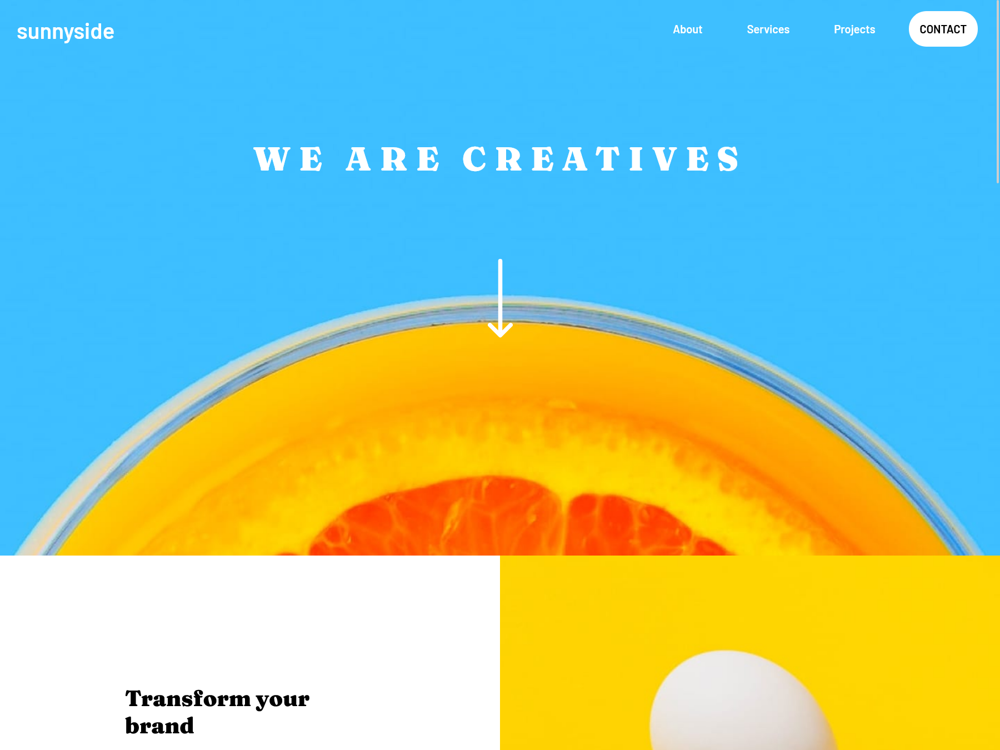

# Frontend Mentor - Sunnyside agency landing page solution

This is a solution to the [Sunnyside agency landing page challenge on Frontend Mentor](https://www.frontendmentor.io/challenges/sunnyside-agency-landing-page-7yVs3B6ef). Frontend Mentor challenges help you improve your coding skills by building realistic projects.

## Table of contents

- [Overview](#overview)
  - [The challenge](#the-challenge)
  - [Screenshot](#screenshot)
  - [Links](#links)
- [My process](#my-process)
  - [Built with](#built-with)
  - [What I learned](#what-i-learned)
  - [Continued development](#continued-development)
  - [Useful resources](#useful-resources)
- [Author](#author)

## Overview

### The challenge

Users should be able to:

- View the optimal layout for the site depending on their device's screen size
- See hover states for all interactive elements on the page

### Screenshot

### Links

- Solution URL: [https://github.com/AakashSahani/aakashsahani.github.io/tree/main/sunnyside-agency-landing-page-main]
- Live Site URL: [https://amazing-souffle-7f87a7.netlify.app/sunnyside-agency-landing-page-main/index.html]

## My process

### Built with

- Semantic HTML5 markup
- CSS custom properties
- Flexbox
- CSS Grid

### What I learned

I learned a lot in this challenge. Especially the menu and multiple styling were a hard.I used on CSS and HTML for this challenge as I want to understand both of these before moving on the Javascript.

### Continued development

I want to learn Responsive design and best practices for CSS.

### Useful resources

- [Oreilly HTML & CSS Course (PAID!)](https://learning.oreilly.com/videos/modern-html-and/9781838822828/) - I took this course at the start of 2022. I learned how to make hamburger menu from Brad Traversy. I recommend him if you want to learn in-depth web development using Hands-on Projects.

## Author

- Website - [Aakash Sahani](https://www.aakashsahani.com)
- Frontend Mentor - [@AakashSahani](https://www.frontendmentor.io/profile/AakashSahani)
